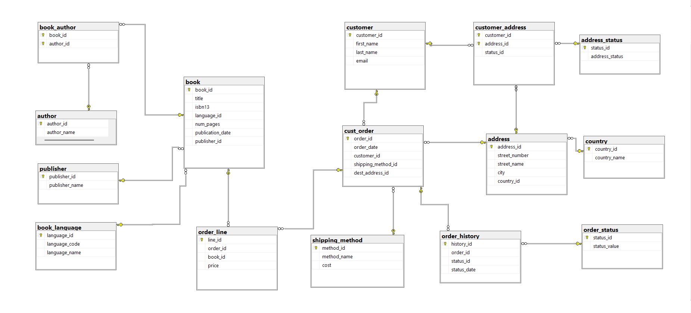
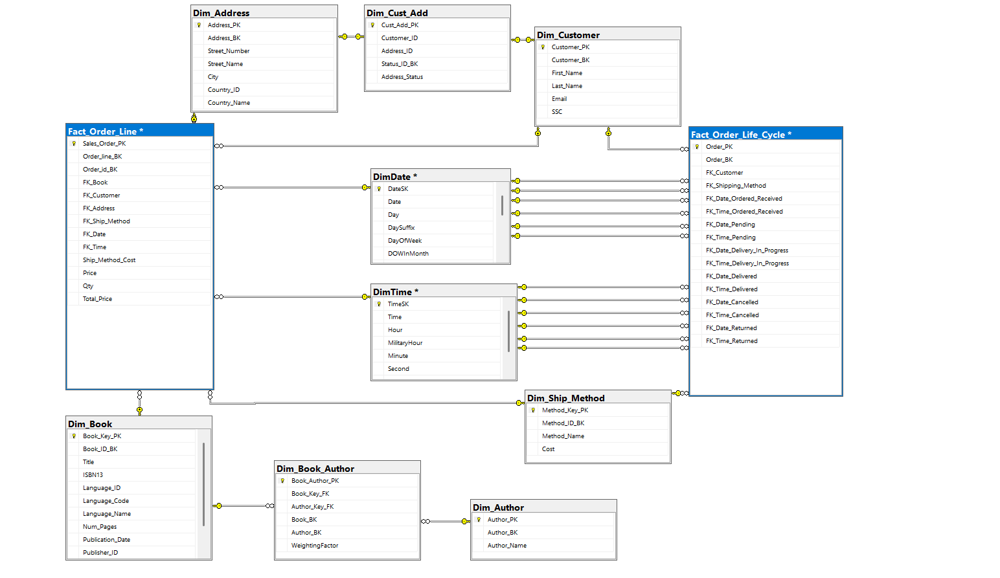

# 📚 GravityBooks Data Warehouse

A fully implemented **Data Warehouse** built on top of the GravityBooks OLTP database using **SQL Server**. This project transforms a normalized bookstore transactional database into a dimensional model optimized for analytical queries and reporting.

The warehouse follows **Kimball's dimensional modeling methodology** and is structured as a **Galaxy Schema (Fact Constellation)** — two fact tables sharing a set of conformed dimensions — with a partial snowflake in the customer-address cluster.

---

## 🗂️ Project Overview

| Item | Detail |
|---|---|
| **Source DB** | `gravity_books` (OLTP) |
| **Target DB** | `BookstoreDWH` (DWH) |
| **Methodology** | Kimball Dimensional Modeling |
| **Schema Type** | Galaxy Schema (Fact Constellation) with partial snowflake |
| **SCD Strategy** | Type 1 – Overwrite (no historical tracking) |
| **Platform** | Microsoft SQL Server (T-SQL) |

---

## 🏗️ Architecture

### Source → OLTP (gravity_books)

The source system contains 13 normalized tables covering books, authors, customers, orders, and shipping:

```
book ──── book_author ──── author
 │
 ├── book_language
 └── publisher

cust_order ──── order_line ──── book
    │
    ├── customer ──── customer_address ──── address ──── country
    │                                           └── address_status
    ├── shipping_method
    └── order_history ──── order_status
```

### Target → DWH (BookstoreDWH)

The warehouse is a **Galaxy Schema (Fact Constellation)**: two fact tables that share a set of conformed dimensions. This is the most precise classification, and it sits within Kimball's broader methodology.

```
┌─────────────────────────────────────────────────────────────────────┐
│                        CONFORMED DIMENSIONS                         │
│         DimDate   DimTime   Dim_Customer   Dim_Ship_Method          │
└────┬──────────┬──────────────────┬──────────────────┬──────────────┘
     │          │                  │                  │
     ▼          ▼                  ▼                  ▼
Fact_Order_Line              Fact_Order_Life_Cycle
     │
     ├── Dim_Book ── Dim_Book_Author (Bridge) ── Dim_Author
     │
     └── Dim_Address
              ▲
              │   ← partial snowflake arm
         Dim_Cust_Add
              │
         Dim_Customer
```

**Why Galaxy and not pure Star?**
- Two fact tables sharing conformed dimensions → **Galaxy / Fact Constellation**
- `Dim_Cust_Add` sits between `Dim_Customer` and `Dim_Address`, introducing one snowflake level rather than folding address info directly into `Dim_Customer`
- Everything else follows star schema principles: denormalized attributes, no further normalization of dimensions

| Schema Pattern | Applies | Reason |
|---|---|---|
| **Kimball Methodology** | ✅ | Surrogate keys, conformed dims, defined grain, SCD Type 1 |
| **Galaxy / Fact Constellation** | ✅ | Two fact tables share `DimDate`, `DimTime`, `Dim_Customer`, `Dim_Ship_Method` |
| **Partial Snowflake** | ✅ | `Dim_Customer → Dim_Cust_Add → Dim_Address` arm is normalized |
| **Pure Star Schema** | ❌ | Snowflake arm prevents this classification |

---

## 📐 Dimensional Model

### Fact Tables

#### `Fact_Order_Line`
- **Grain:** One row per order line item (`line_id` + `order_id`)
- **Key Measures:** `Price`, `Qty` (defaulted to 1), `Ship_Method_Cost` (denormalized), `Total_Price = (Price × Qty) + Ship_Method_Cost`

| Column | Description |
|---|---|
| `Order_line_BK` | Business key from `order_line.line_id` |
| `Order_id_BK` | Business key from `cust_order.order_id` |
| `FK_Book` | → `Dim_Book` |
| `FK_Customer` | → `Dim_Customer` |
| `FK_Address` | → `Dim_Address` |
| `FK_Ship_Method` | → `Dim_Ship_Method` |
| `FK_Date / FK_Time` | → `DimDate` / `DimTime` |
| `Ship_Method_Cost` | Denormalized at load time |
| `Total_Price` | Calculated: `(Price × Qty) + Ship_Method_Cost` |

#### `Fact_Order_Life_Cycle`
- **Grain:** One row per order (`order_id`)
- **Design:** Tracks up to 6 order status milestones with nullable Date/Time FK pairs

| Status Milestone | FK Columns |
|---|---|
| Order Received | `FK_Date/Time_Ordered_Received` |
| Pending | `FK_Date/Time_Pending` |
| Delivery In Progress | `FK_Date/Time_Delivery_In_Progress` |
| Delivered | `FK_Date/Time_Delivered` |
| Cancelled | `FK_Date/Time_Cancelled` |
| Returned | `FK_Date/Time_Returned` |

---

### Dimension Tables

> 💡 **Conformed dimensions** (`DimDate`, `DimTime`, `Dim_Customer`, `Dim_Ship_Method`) are shared across both fact tables — this is what makes the schema a **Galaxy**. The `Dim_Customer → Dim_Cust_Add → Dim_Address` chain forms the **partial snowflake** arm.

| Table | Description | Key Design Note |
|---|---|---|
| `Dim_Book` | Book catalog | `Publisher_Name` & language fields denormalized in |
| `Dim_Author` | Author records | Simple lookup dimension |
| `Dim_Book_Author` | **Bridge table** | Resolves M:M between books and authors; `WeightingFactor = 1 / author count per book` |
| `Dim_Customer` | Customer profiles | Retains `Address_ID` & `Status_ID` refs from most recent `customer_address` record |
| `Dim_Address` | Delivery addresses | `Country_Name` denormalized in from `country` table |
| `Dim_Cust_Add` | Customer–address link | Resolves customer-to-address relationship with status |
| `Dim_Ship_Method` | Shipping options | Includes `Cost` for denormalization into fact |
| `DimDate` | Date dimension | Populated separately by user; key = `YYYYMMDD` integer |
| `DimTime` | Time dimension | Populated separately by user; grain = seconds |

---


---

## 🚀 Execution Order

Run the scripts in the following sequence:

```
1. 1_Description__DB.sql          → Create BookstoreDWH database
2. 2_Create_Dimensions.sql        → Create dimension tables
3. 2_Create_Fact_Tables.sql       → Create fact tables
4. 3_create_indexes_on_...sql     → Create performance indexes
5. [YOUR SCRIPT]                  → Populate DimDate and DimTime
6. 4_ETL_Dimension.sql            → Load dimensions (order matters):
       ETL-1  Dim_Ship_Method
       ETL-2  Dim_Address
       ETL-3  Dim_Cust_Add
       ETL-4  Dim_Customer
       ETL-5  Dim_Author
       ETL-6  Dim_Book
       ETL-7  Dim_Book_Author  ← must be last (bridge table)
7. 5_ETL_Facts.sql               → Load facts:
       ETL-8   Fact_Order_Line
       ETL-9   Fact_Order_Life_Cycle (INSERT then 5× UPDATE passes)
```

---

## ⚙️ Key Design Decisions

- **Galaxy Schema (Fact Constellation):** Two fact tables (`Fact_Order_Line` and `Fact_Order_Life_Cycle`) share four conformed dimensions — `DimDate`, `DimTime`, `Dim_Customer`, and `Dim_Ship_Method`. This multi-fact structure is the defining characteristic of a Galaxy Schema within the Kimball framework.
- **Partial Snowflake:** Rather than fully denormalizing address data into `Dim_Customer`, a deliberate snowflake arm (`Dim_Customer → Dim_Cust_Add → Dim_Address`) was kept to cleanly represent the M:M customer-address relationship from the OLTP source. All other dimensions are fully denormalized (star).
- **SCD Type 1 (Overwrite):** No historical attribute changes are tracked. Dimension rows are updated in place.
- **Grain enforcement:** `UNIQUE` constraints on `Order_line_BK + Order_id_BK` (Fact_Order_Line) and `Order_BK` (Fact_Order_Life_Cycle) prevent duplicate loads.
- **Bridge table weighting:** `Dim_Book_Author.WeightingFactor` = `1 / number of authors per book`, enabling proportional credit allocation in analytics.
- **Denormalization:** `Country_Name`, `Publisher_Name`, and language fields are folded into their parent dimensions to avoid unnecessary snowflaking.
- **`Fact_Order_Life_Cycle` ETL pattern:** Uses one `INSERT` for the initial "Order Received" status, followed by five separate `UPDATE` passes — one per subsequent status — to populate nullable milestone columns.
- **`Qty` default:** The OLTP `order_line` table has no quantity column; `Qty` is defaulted to `1` in the fact table.

---

## 🔧 Prerequisites

- Microsoft SQL Server (2016 or later recommended)
- Both databases accessible from the same SQL Server instance:
  - `gravity_books` — source OLTP database
  - `BookstoreDWH` — target warehouse (created by script 1)
- User-supplied scripts to populate `DimDate` and `DimTime` before ETL runs

---

## 📊 Example Analytics Enabled

Once loaded, the warehouse supports queries such as:

- **Sales by book, author, language, or publisher** over any time period
- **Customer order history** with full lifecycle status tracking (pending → delivered / cancelled / returned)
- **Shipping method performance** — cost analysis and delivery time patterns
- **Geographic sales distribution** by country and city
- **Author revenue attribution** via weighted bridge table joins
- **Order funnel analysis** — how many orders reach each status milestone

---


## 📸 Schema Diagrams

### OLTP Source Schema (gravity_books)


---

### DWH Target Schema (BookstoreDWH)
> Galaxy Schema — two fact tables (green) sharing conformed dimensions (blue), with a partial snowflake in the customer-address cluster.




## 🤝 Credits

| Role | Name | LinkedIn |
|---|---|---|
| **Author** | Ahmed Adel | [](https://www.linkedin.com/in/ahmed-data-eng/) |
| **Mentor** | Eng. Abdelwahed Ashraf *(ITI)* | [](https://www.linkedin.com/in/abdelwahedashraf/) |
